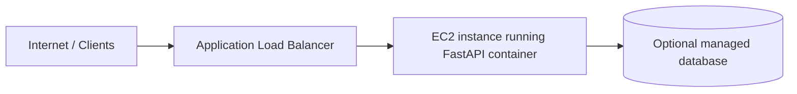
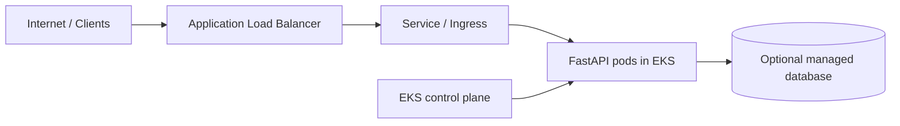

# Terraform AWS deployment

This directory contains modular Terraform for two production-ready deployment approaches:

1. EC2 deployment with a public ALB and a single application instance
2. EKS deployment with a managed Kubernetes cluster and worker nodes

## Structure

- modules/networking: VPC, subnets, NAT gateway, route tables, and NACLs
- modules/security: ALB and app security groups, plus EKS security groups
- modules/iam: IAM roles and instance profiles for EC2 and EKS
- environments/ec2: Terraform for EC2 deployment
- environments/eks: Terraform for EKS deployment

## Usage

Choose exactly one deployment path. Provisioning the EC2 environment and the EKS environment together is not required and would create separate AWS resources.

### Option 1: Deploy to EC2

This provisions a VPC, public/private subnets, security groups, an ALB, and a single EC2 instance that can run the application container.

```bash
cd infra/terraform/environments/ec2
terraform init
terraform plan -var-file=terraform.tfvars
terraform apply -var-file=terraform.tfvars
```

Create a local terraform.tfvars file if you have not already:

```hcl
region = "us-east-1"
name   = "fastapi-prod"
admin_cidr_blocks = ["203.0.113.0/24"]
```

To destroy the EC2 deployment:

```bash
terraform destroy -var-file=terraform.tfvars
```

### Option 2: Deploy to EKS

This provisions a VPC, subnets, IAM roles, security groups, an EKS cluster, and a managed node group.

```bash
cd infra/terraform/environments/eks
terraform init
terraform plan -var-file=terraform.tfvars
terraform apply -var-file=terraform.tfvars
```

Example terraform.tfvars:

```hcl
region = "us-east-1"
name   = "fastapi-prod"
admin_cidr_blocks = ["203.0.113.0/24"]
```

To destroy the EKS deployment:

```bash
terraform destroy -var-file=terraform.tfvars
```

## Architecture diagrams

### EC2 deployment



### EKS deployment



## Custom environment variables and monitoring

### EC2

The EC2 environment uses a rendered user-data script that writes a container env file and starts the application with Docker. You can pass custom values such as database URLs or feature flags through the `app_env` variable.

Example:

```hcl
app_env = {
  APP_ENVIRONMENT = "production"
  APP_LOG_LEVEL   = "INFO"
  APP_CORS_ORIGINS = "https://example.com"
}
```

For monitoring, the EC2 path provisions a CloudWatch log group and can be extended with CloudWatch Agent, SSM, or a monitoring stack such as Prometheus/Grafana.

### EKS

The EKS environment can consume the same app environment variables in a Kubernetes Deployment manifest. The example template includes Prometheus scrape annotations so you can plug in a monitoring solution such as Prometheus Operator or CloudWatch Container Insights.

Example:

```hcl
app_env = {
  APP_ENVIRONMENT = "production"
  APP_LOG_LEVEL   = "INFO"
  APP_CORS_ORIGINS = "https://example.com"
}
```

## Verify without deploying to AWS

You can validate most of the setup locally before touching AWS.

### 1. Terraform syntax and formatting

Run this from either environment directory:

```bash
terraform fmt -check -recursive
terraform validate
```

Expected result: Terraform reports no syntax or configuration errors.

### 2. Rendered configuration checks

For the EC2 path, confirm the user-data template renders with your variables:

```bash
terraform console <<'EOF'
jsonencode(templatefile("./user_data.tpl", {
  app_env         = { APP_ENVIRONMENT = "production" }
  container_image = "ghcr.io/OWNER/REPO:latest"
  region          = "us-east-1"
  log_group_name  = "/aws/ec2/fastapi"
}))
EOF
```

For the EKS path, confirm the deployment manifest template renders:

```bash
terraform console <<'EOF'
templatefile("./app-deployment.yaml.tpl", {
  app_name  = "fastapi"
  app_image = "ghcr.io/OWNER/REPO:latest"
  app_env   = { APP_ENVIRONMENT = "production" }
})
EOF
```

### 3. Local Docker image validation

Build the application image locally to verify the container can start:

```bash
cd ../..
 docker build -f Dockerfile -t fastapi-example:test .
 docker run --rm -p 8000:8000 fastapi-example:test
```

Then test the endpoint:

```bash
curl http://127.0.0.1:8000/healthz
```

### 4. Static review for AWS-specific pieces

Check that the Terraform files include the following items:

- VPC and subnets
- Security groups / NACLs
- IAM roles and policies
- ALB or EKS cluster resources
- Container image reference in the deployment path
- Environment variables passed into the app container
- Logging/monitoring hook points

### 5. Optional pre-flight checks for secrets and monitoring

If you plan to use secrets or monitoring later, verify these placeholders are added before deployment:

- Secrets Manager or SSM Parameter Store references
- CloudWatch Agent or Prometheus configuration
- Alerting rules or dashboards

## Notes

- Replace the sample CIDR blocks and AMI values with your own environment-specific values.
- For production, add an ALB certificate, Route53 DNS, ECR repository, and remote state backend.
- Consider using a managed PostgreSQL or other data service as needed for your application.
