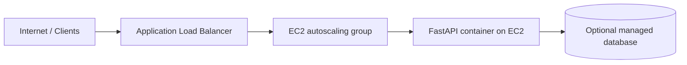

# Terraform AWS deployment

This directory contains Terraform for a production-oriented AWS deployment of the FastAPI application on EC2.

## Architecture

The deployment uses:

- a VPC with public and private subnets
- an Application Load Balancer in the public subnets
- EC2 instances in the private subnets
- a launch template for the application container
- an autoscaling group that scales based on HTTP traffic
- CloudWatch logs and IAM roles for the instances

## Structure

- modules/networking: VPC, subnets, NAT gateway, route tables, and NACLs
- modules/security: ALB and app security groups
- modules/iam: IAM roles and instance profiles for EC2
- environments/ec2: Terraform for the EC2 autoscaling deployment

## Deploy to EC2

This provisions a VPC, subnets, security groups, an ALB, and an autoscaling group of EC2 instances that run the application container.

```bash
cd infra/terraform/environments/ec2
terraform init
terraform plan -var-file=terraform.tfvars
terraform apply -var-file=terraform.tfvars
```

Create a local terraform.tfvars file if you have not already:

```hcl
region = "us-east-1"
name   = "fastapi-prod"
admin_cidr_blocks = ["203.0.113.0/24"]
container_image = "ghcr.io/OWNER/REPO:latest"

desired_capacity = 2
min_size         = 2
max_size         = 6
target_http_requests_per_target = 25
```

To destroy the deployment:

```bash
terraform destroy -var-file=terraform.tfvars
```

## Architecture diagram



## Auto scaling behavior

The autoscaling group uses a target-tracking policy based on ALB request count per target. The default target is 25 requests per target per minute, which is a sensible starting point for a small FastAPI workload.

Recommended defaults:

- desired capacity: 2
- minimum capacity: 2
- maximum capacity: 6
- target value: 25 requests per target per minute

## Environment variables and monitoring

The EC2 environment uses a rendered user-data script that writes a container env file and starts the application with Docker. You can pass custom values such as database URLs or feature flags through the app_env variable.

Example:

```hcl
app_env = {
  APP_ENVIRONMENT  = "production"
  APP_LOG_LEVEL    = "INFO"
  APP_CORS_ORIGINS = "https://example.com"
}
```

For monitoring, the deployment provisions a CloudWatch log group and can be extended with CloudWatch Agent, SSM, or alarms for CPU, memory, and ALB request count.

## Verify without deploying to AWS

You can validate most of the setup locally before touching AWS.

### 1. Terraform syntax and formatting

Run this from the EC2 environment directory:

```bash
terraform fmt -check -recursive
terraform validate
```

### 2. Rendered configuration checks

Confirm the user-data template renders with your variables:

```bash
terraform console <<'EOF'
jsonencode(templatefile("./user_data.tpl", {
  app_env         = { APP_ENVIRONMENT = "production" }
  container_image = "ghcr.io/OWNER/REPO:latest"
  region          = "us-east-1"
  log_group_name  = "/aws/ec2/fastapi"
}))
EOF
```

### 3. Local Docker image validation

Build the application image locally to verify the container can start:

```bash
cd ../..
docker build -f Dockerfile -t fastapi-example:test .
docker run --rm -p 8000:8000 fastapi-example:test
```

Then test the endpoint:

```bash
curl http://127.0.0.1:8000/healthz
```

## Best practices for AWS EC2 deployment

- Keep application instances in private subnets and expose them only through the ALB.
- Use a launch template so the instance configuration is versioned and repeatable.
- Use ALB health checks and let the autoscaling group replace unhealthy instances.
- Store secrets in SSM Parameter Store or Secrets Manager instead of embedding them in user data.
- Use CloudWatch alarms for CPU, memory, and request volume.
- Add an HTTPS listener with an ACM certificate for production traffic.
- Consider using ECR for container images and a managed database service for persistence.
